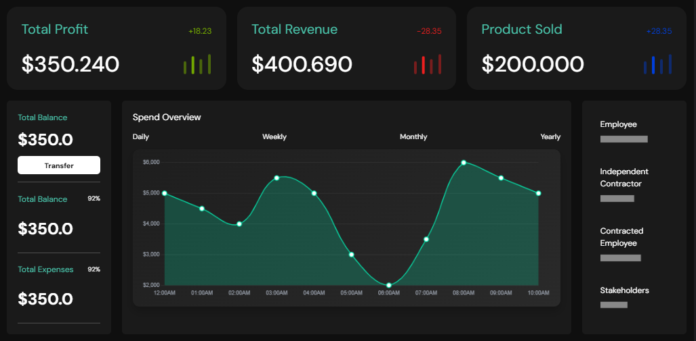
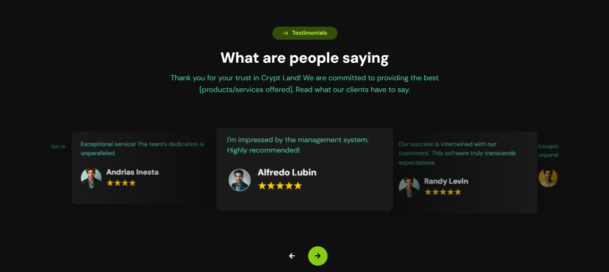

# 🔥 FinBiz - Your Finance Solutions for Business 💼📊

## ✨ Overview
Welcome to **FinBiz** - a React-based web application built to empower finance teams and streamline financial management for small and medium-sized businesses. Designed with precision and attention to detail from a Figma prototype, this project combines modern UI with functional components to deliver a seamless experience.

<div align="center">
   
 </div>  

<div align="center">
  Made with ❤️ by [Ahmed Al-Sanadi]
  
  ⭐ Star this repo if you find it helpful!
</div>


---

## 🌟 Features

- **Dynamic Navbar** - Includes smooth navigation across sections and a responsive design with a mobile menu.
- **Interactive Hero Section** - Welcomes users with a headline, description, and call-to-action elements.
- **Charts and Stats Dashboard** - Shows key financial metrics like Profit, Revenue, and Product Sold, using intuitive visualizations.
- **User Testimonials** - Displays reviews to build trust and provide social proof.
- **Flexible Pricing Plans** - Structured plans for users with customized styling for easy comparison.
- **Pre-Footer Section** - Engages users with additional resources and insights.
- **Fully Responsive** - Smooth design that adapts across all device sizes, from desktop to mobile.

## 🛠️ Technologies Used

- **React** (`^18.3.1`) - Component-based architecture for building user interfaces.
- **React DOM** (`^18.3.1`) - Integration of React components with the web DOM.
- **CSS Modules** - For scoped and organized styling.
- **AOS (Animate on Scroll)** (`^2.3.4`) - Adds beautiful animations on scroll.
- **JavaScript ES6+** - Modern JavaScript for clean and concise code.
- **Chart.js** (`^4.4.4`) - Library for creating responsive, interactive charts.
- **React Chart.js 2** (`^5.2.0`) - A wrapper for integrating Chart.js with React.
- **React Icons** (`^5.3.0`) - Collection of popular icons as React components.
- **Swiper** (`^11.1.12`) - A customizable slider/carousel library.


## 📸 Screenshots





## 🚀 Getting Started

To get a local copy up and running, follow these steps:

### Prerequisites

- Node.js and npm installed on your machine

### 🛠️ Installation

1. **Clone the repository**

   ```bash
   git clone https://github.com/ahmedalsanadi/FinBiz.git
   ```

2. **Navigate into the directory**

   ```bash
   cd FinBiz
   ```

3. **Install dependencies**

   ```bash
   npm install
   ```

4. **Run the app**

   ```bash
   npm start
   ```

   The app will open at `http://localhost:3000` in your default web browser.

## 🧩 Components

This project is structured into modular components, each serving a distinct function:

- `Navbar` - Responsive navigation bar
- `HeroSection` - Initial call-to-action section with headline and email input
- `MiddleNav` - Secondary navigation for quick access
- `CardSection` - Displays detailed information in a card layout
- `ChartsSection` - Graphs showing financial metrics like profit and revenue
- `PlanSection` - Available pricing plans
- `TestimonialSection` - Reviews from satisfied customers
- `Footer` - App footer with contact info and links
-  And more

## ✨ Key Functionalities

- **Email Input Form** - Collects emails in the Hero Section.
- **Responsive Navbar** - Adaptable menu that adjusts to screen size.
- **Data-Driven Charts** - Visualizes financial stats dynamically.
- **Scroll Animations** - Smooth transitions for an engaging user experience.

## 🤝 Contributing

We welcome contributions! If you have suggestions, feel free to fork the repository and submit a pull request.

1. Fork the Project
2. Create your Feature Branch (`git checkout -b feature/YourFeature`)
3. Commit your Changes (`git commit -m 'Add YourFeature'`)
4. Push to the Branch (`git push origin feature/YourFeature`)
5. Open a Pull Request

## 📄 License

This project is licensed under the MIT License - see the [LICENSE](./LICENSE) file for details.

## 📧 Contact

- **Ahmed Al-Sanadi** - [AhmedAlsanadi40@gmail.com](mailto:AhmedAlsanadi40@gmail.com)
- **Project Link** - [https://github.com/ahmedalsanadi/finbiz](https://github.com/ahmedalsanadi/FinBiz)

---

Made with ❤️ by **Ahmed-Al-Sanadi** --⭐ Star this repo if you find it helpful!

---